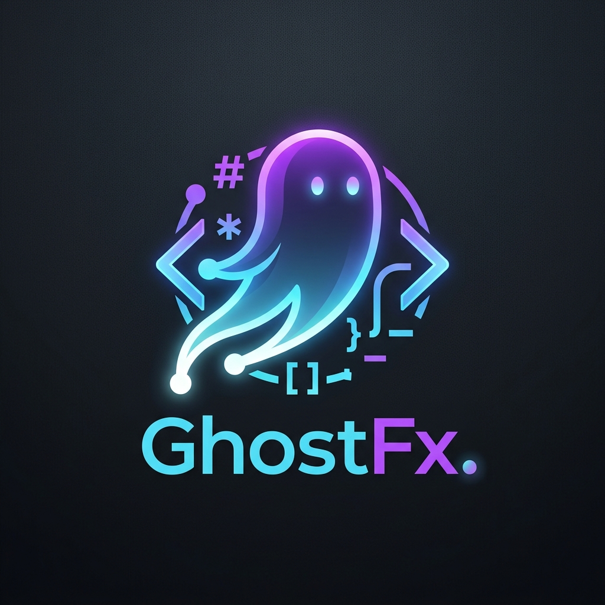

<div align="center">

  # GhostFx

  


**Live-migrate Ghost blogs & JSON exports to Git-versioned Markdown configured for DocFX static site generation.**

[](https://dotnet.microsoft.com/)
[](LICENSE)
[](https://www.nuget.org/packages/GhostFx)
[](https://www.nuget.org/packages/GhostFx)

</div>

---

## 🚀 Key Features

- 👻 **Live Ghost Admin API Integration**: Connect to live Ghost instances using JWT-authenticated Ghost Admin API keys to extract posts, tags, and drafts.
- 📦 **Offline JSON Export & Stdin Piping**: Parse local Ghost database JSON exports (`sample-ghost-export.json`) or pipe JSON directly via standard input (`stdin`).
- 📝 **Markdown & Front-Matter Engine**: Converts Ghost HTML posts into clean Markdown files with YAML front-matter (`uid`, `title`, `slug`, `date`, `tags`, `metaTitle`, `metaDescription`, `image`, `og_title`, `og_description`).
- 📚 **DocFX Static Site Builder Integration**: Automatically generates `docfx.json`, `index.md`, `toc.yml`, and tag index pages organized into clean subfolders (`published/`, `pages/`, `draft/`, `scheduled/`, `content/images/`).
- 🎨 **Theme Conversion**: Convert active Ghost themes (ZIP archives or unzipped folders) directly into DocFX modern theme overrides (`public/main.css`, `public/main.js`).
- 🤫 **Quiet Mode & Cross-Platform Pipe Workflows**: Run silently with `--quiet` / `-q` or pipe input/output streams cleanly across Windows, Linux, and macOS.
- ⚡ **Built on .NET 10 & SLNX**: High-performance, cross-platform CLI powered by `.NET 10` and modern `.slnx` solution architecture.

---

## 📦 Installation

### Global Tool Installation

Pack and install `ghostfx` as a global .NET CLI tool:

```bash
dotnet pack GhostFx.Cli/GhostFx.Cli.csproj
dotnet tool install --global --add-source ./GhostFx.Cli/nupkg GhostFx
```

---

## 🛠️ Usage

### Quick Start with Configuration File

Create a `ghostfx.json` configuration file in your directory:

```json
{
  "ghostUrl": "https://myblog.ghost.io",
  "adminApiKey": "YOUR_KEY_ID:YOUR_KEY_SECRET",
  "ghostExportJson": "sample-ghost-export.json",
  "outputDir": "articles",
  "indexFile": "index.md",
  "siteTitle": "My Static DocFX Site",
  "includeDrafts": false,
  "downloadTheme": false,
  "themePath": "ghostfx.zip",
  "quiet": false
}
```

Run the migration:

```bash
ghostfx
```

### CLI Command Options & Pipe Workflows

You can override or supply all migration settings directly via CLI flags or piped streams:

```bash
# Migrate from a live Ghost instance
ghostfx --url "https://myblog.ghost.io" --api-key "ID:SECRET" --output "articles" --site-title "My Tech Blog"

# Migrate from a local Ghost JSON export
ghostfx --input "./sample-ghost-export.json" --output "articles" --include-drafts true

# Quiet mode execution
ghostfx --config "./ghostfx.json" --quiet

# Pipe JSON export directly via stdin
cat sample-ghost-export.json | ghostfx --quiet -o sample_output

# Custom configuration file
ghostfx --config "./configs/my-ghostfx-config.json"
```

#### CLI Flags Reference

| Option | Description | Default |
|---|---|---|
| `--config <path>` | Path to custom `ghostfx.json` file | `ghostfx.json` |
| `--url <url>` | Live Ghost blog base URL | — |
| `--api-key <key>` | Ghost Admin API key (`ID:SECRET`) | — |
| `--input <path>` | Path to offline Ghost JSON export file | — |
| `--output <dir>` | Target output directory for Markdown posts | `articles` |
| `--index-file <file>` | Path for generated homepage Markdown file | `index.md` |
| `--site-title <title>` | Title of static site | `My Static Blog` |
| `--include-drafts <bool>` | Process draft posts in addition to published posts | `false` |
| `--download-theme <bool>` | Download active Ghost theme | `false` |
| `--theme-path <path>` | Path to theme ZIP archive or unzipped theme folder | `ghostfx.zip` |
| `--logo-path <bool>` | Generate `_appLogoPath` in `docfx.json` | `true` |
| `--quiet`, `-q` | Quiet mode (suppresses banners and progress animations) | `false` |
| `--yes`, `-y` | Non-interactive automatic confirmation | `false` |

---

## 📁 Output Directory Structure

Generated static site source files are organized under `outputDir`:

```
<outputDir>/
├── docfx.json
├── index.md
├── tags.md
├── toc.yml
├── published/         # Published posts
│   └── post-slug.md
├── pages/             # Ghost pages
│   └── page-slug.md
├── draft/             # Draft posts
│   └── draft-slug.md
├── scheduled/         # Scheduled posts
│   └── post-slug.md
├── content/
│   └── images/        # Backwards-compatible Ghost media & brand assets
│       └── 2024/05/sample.jpg
└── template/
    └── ghostfx/       # Converted DocFX modern theme overrides
```

---

## 🏗️ Repository Architecture

GhostFx is organized into modular .NET 10 projects:

```
GhostFx/
├── GhostFx.slnx           # Modern XML solution file (.NET 10)
├── GhostFx.Core/          # Core library (MigrationEngine, GhostAdminClient, DocfxGenerator, MarkdownConverter)
├── GhostFx.Cli/           # Command-line entrypoint powered by System.CommandLine
└── GhostFx.Tests/         # xUnit unit test suite
```

### Developer Workflow

```bash
# Build solution
dotnet build GhostFx.slnx

# Run tests
dotnet test GhostFx.slnx

# Execute CLI locally
dotnet run --project GhostFx.Cli/GhostFx.Cli.csproj -- --help
```

---

## 📄 License

This project is licensed under the [MIT License](LICENSE).
